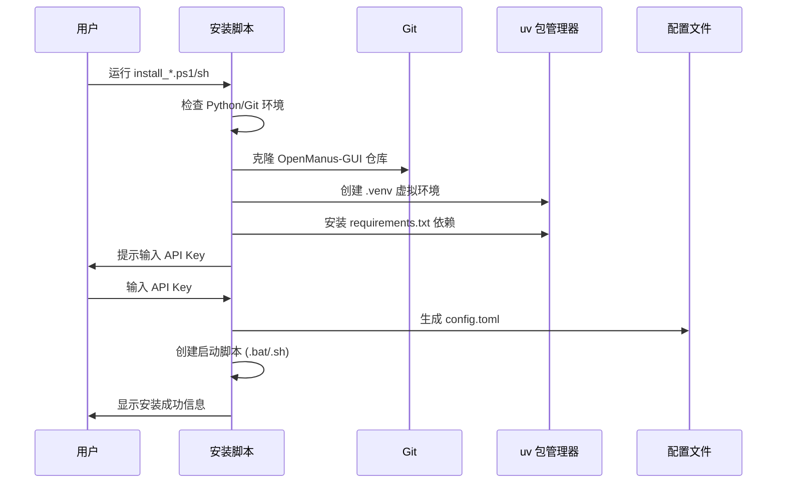
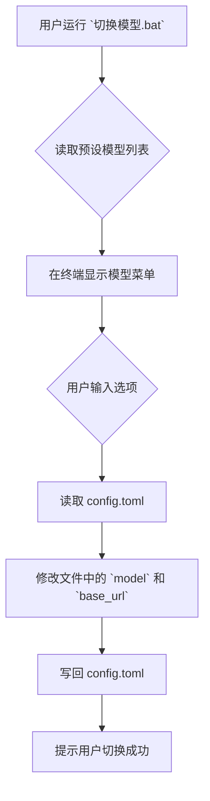

# 架构文档

> 本文档由 Manus 自动生成和维护。最后更新于：2026-03-02

## 1. 项目概述

本项目是一个为开源 AI Agent 框架 [OpenManus](https://github.com/FoundationAgents/OpenManus) 深度定制的一键部署与管理工具集。它旨在简化本地部署流程，提供便捷的多模型切换能力和多种交互界面（终端、Web UI），让用户可以开箱即用一个功能强大、类似商业级产品的本地 AI Agent 系统。

核心价值在于降低普通用户的技术门槛，通过自动化脚本和清晰的文档，将一个复杂的 Agent 系统封装成易于安装、使用和管理的产品级解决方案。

## 2. 技术栈

| 分类 | 技术 | 版本/说明 |
| :--- | :--- | :--- |
| **核心框架** | [OpenManus](https://github.com/FoundationAgents/OpenManus) | Agent 核心能力（思考、工具调用） |
| **Web UI 框架** | [Gradio](https://www.gradio.app/) | 提供带对话历史的 Web 交互界面 |
| **编程语言** | Python, PowerShell, Bash | `Python` 用于核心工具，`PowerShell` 和 `Bash` 用于自动化安装脚本 |
| **包管理器** | [uv](https://github.com/astral-sh/uv) | 用于快速创建 Python 虚拟环境和安装依赖 |
| **外部依赖** | OpenAI API, Ollama | `OpenAI` 用于云端大模型，`Ollama` 用于本地大模型 |
| **版本控制** | Git | 用于项目版本管理和分发 |

## 3. 目录结构

```
.
├── .gitignore
├── ARCHITECTURE.md
├── README.md
├── RUNBOOK.md
├── install_unix.sh
├── install_webui_unix.sh
├── install_webui_windows.ps1
├── install_windows.ps1
├── switch_model.py
├── 中文使用说明.md
├── 切换模型.bat
├── 启动Agent.bat
├── app_ui_enhanced.py
├── apply_ui_upgrade.bat
└── apply_ui_upgrade.sh
```

### 关键文件说明

| 文件/目录 | 主要功能 |
| :--- | :--- |
| `install_*.ps1/sh` | **安装脚本**：核心资产，负责自动化环境检测、项目克隆、依赖安装、配置生成。分为 Windows/Unix 和 Web/终端 四种组合。 |
| `switch_model.py` | **模型切换工具**：允许用户在多种云端和本地大模型之间一键切换，无需手动修改配置文件。 |
| `启动*.bat` / `start_*.sh` | **启动脚本**：安装完成后生成，用于一键启动 Agent 的不同模式（Web UI, 终端, API 服务）。 |
| `RUNBOOK.md` | **运行手册**：手把手教学，指导用户从零开始完成安装和日常使用。 |
| `中文使用说明.md` | **功能说明**：对项目的功能、特点和目录结构进行详细解释。 |
| `OpenManus-GUI/` | **(安装后生成)** OpenManus-GUI 项目的实际安装目录，包含 Agent 核心代码和 Web UI。 |
| `app_ui_enhanced.py` | **优化版 UI**：基于原版 `app_ui.py` 深度美化，添加现代化 CSS、模型状态显示、中文界面等。 |
| `apply_ui_upgrade.*` | **UI 升级脚本**：一键将默认 UI 替换为优化版，支持备份和回滚。 |

## 4. 核心模块与数据流

本项目的核心是**围绕 OpenManus Agent 的自动化封装**，数据流清晰直接。

### 4.1. 安装流程



### 4.2. 模型切换流程



## 5. 外部依赖与集成

| 服务/库 | 用途 | 集成方式 |
| :--- | :--- | :--- |
| **GitHub** | 代码托管与分发 | 通过 `git clone` 下载 Agent 核心代码和本工具集。 |
| **OpenAI API** | 云端大模型 | 用户提供 API Key，Agent 通过 HTTPS 请求调用。 |
| **Ollama** | 本地大模型 | 用户在本地安装 Ollama 服务，Agent 通过 `http://localhost:11434` 调用。 |

## 6. 环境变量

本项目不直接依赖于操作系统的环境变量，而是通过在安装时生成的 `config/config.toml` 文件来管理配置，关键配置项包括：

| 配置项 | 描述 | 示例值 |
| :--- | :--- | :--- |
| `llm.api_key` | OpenAI 或其他云端模型的 API Key | `sk-xxxxxxxx` |
| `llm.model` | 当前使用的模型名称 | `gpt-4.1-mini` |
| `llm.base_url` | 模型 API 的地址 | `https://api.openai.com/v1` |

## 7. 项目进度

> 记录项目从开始到现在已经完成的所有工作，每次新增追加到末尾。

| 完成日期 | 完成的功能/工作 | 说明 |
| :--- | :--- | :--- |
| 2026-03-02 | 初始化部署工具集 | 创建了 Windows 和 Unix 的一键安装脚本和模型切换工具。 |
| 2026-03-02 | 引入 Web UI | 集成了 OpenManusWeb，提供了浏览器交互界面。 |
| 2026-03-02 | 路径和脚本优化 | 统一了安装路径，修复了脚本中文乱码等问题。 |
| 2026-03-02 | 升级到 OpenManus-GUI | 切换到功能更完善的 Gradio Web UI，支持对话历史和多会话。 |
| 2026-03-02 | 创建架构文档 | 按照 `update-tech-doc` 技能要求，生成了本项目的第一版架构文档。 |
| 2026-03-02 | UI 界面优化 | 创建 `app_ui_enhanced.py`，添加现代化 CSS 主题、渐变色标题栏、模型状态徽章、中文界面、美化聊天气泡等。 |

## 8. 更新日志

| 日期 | 变更类型 | 描述 |
| :--- | :--- | :--- |
| 2026-03-02 | 初始化 | 创建项目架构文档 |
| 2026-03-02 | 优化重构 | 新增 `app_ui_enhanced.py` 优化版 UI 和一键升级脚本 |

*变更类型：`新增功能` / `优化重构` / `修复缺陷` / `配置变更` / `文档更新` / `依赖升级` / `初始化`*

---

*此文档旨在提供项目架构的快照，具体实现细节请参考源代码。*
